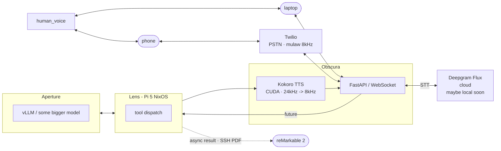

# Moth

A sketch of a STT <-> Harness <-> Agent <-> TTS loop. Talk through requirements on a
phone call. Have them executed. Get results back on your reMarkable instead of
your screen. Take a walk.

Many thanks to [Nick Tikhonov](https://www.ntik.me/posts/voice-agent)

Essay: [Moths to Flame](https://porquenolostres.substack.com) -- the why is in there.

---

## Architecture



## Components

| Component | What | Where |
|-----------|------|-------|
| `main.py` | FastAPI server, WebSocket handler, turn logic | Obscura |
| `tts.py` | Kokoro TTS pipeline (24kHz float32, resampled to mulaw 8kHz) | Obscura / CUDA |
| `push_to_remarkable.py` | SSH PDF push to reMarkable 2 | Obscura -> reMarkable |
| `pdf.py` | Markdown -> PDF for reMarkable delivery | Obscura |
| Deepgram Flux | STT with turn detection (`eot_threshold=0.7`) | cloud |
| vllm | Gemma 4 31B, OpenAI-compat, `enable_thinking=False` | Aperture (DGX Spark) |
| Twilio | PSTN gateway, media streams via WebSocket | cloud |

## Turn flow

```
Twilio media stream (mulaw 8kHz)
  -> audio_q
  -> Deepgram Flux (EndOfTurn event)
  -> transcript_q
  -> handle_turn()
      -> LLM stream (Aperture)
      -> sentence chunker (split on .!?;:)
      -> Kokoro TTS per sentence
      -> send_audio() -> Twilio -> phone
```

Barge-in: want transcript arriving during speech cancels the current turn,
clears the Twilio audio buffer, and starts a new turn. Echo suppression
gates on `last_spoke_at` (4s window).

## Current state

Working: phone call -> STT -> LLM -> TTS -> phone. Barge-in moving closer to working.
Echo suppression rough but functional.

Planned:

- Tool dispatch to lens (bd, shell exec, opencode agentic loop, sandbox)
- Async result delivery: push PDF to reMarkable on job completion
- Tighter echo cancellation

## Config

`config.py` -- Twilio creds, Deepgram API key, Aperture URL/model, TTS voice/speed.
Secrets are inline for now; move to env before sharing.

## Run

```sh
bash run.sh   # starts uvicorn on :8080, expects ngrok or equivalent for Twilio webhook
```

Twilio webhook: `POST /voice` -> TwiML `<Stream>` -> `wss://<host>/ws`
